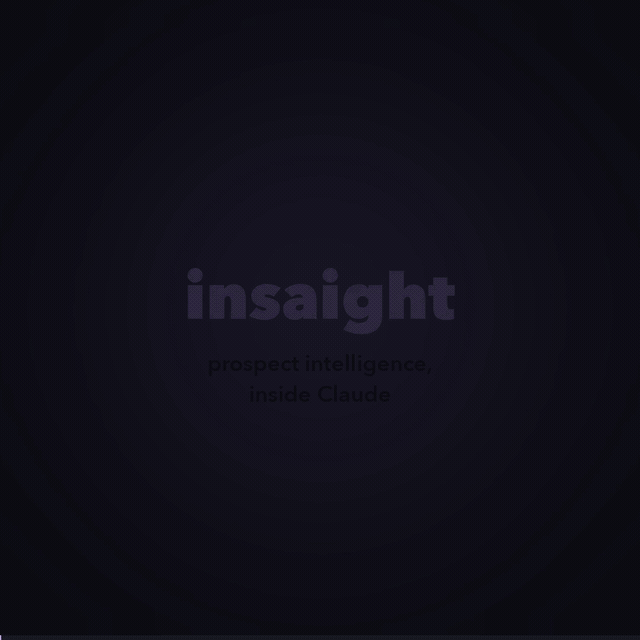
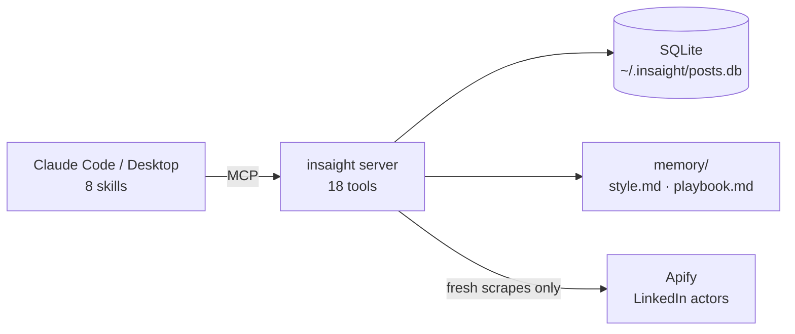

# insaight

**LinkedIn prospect intelligence inside Claude — it automates the research, not the outreach.**

[](LICENSE)
[](https://github.com/spirosbax/insaight/actions/workflows/tests.yml)
[](https://www.python.org/)

<p align="center"></p>

Insaight scrapes public LinkedIn data via [Apify](https://apify.com), stores it in local SQLite, and hands it to Claude through an [MCP server](https://modelcontextprotocol.io/) and eight skills. Data flows in once, then stays on your machine — repeat questions hit SQLite, not Apify.

```text
"Research Anthropic"           → intelligence brief from company + exec posts, prospect score included
"Draft outreach to their CEO"  → personalized DM + email, written in your learned voice
"I sent it" ... "She replied!" → logged; after enough outcomes Insaight proposes evidence-backed
                                 updates to its memory of your style and what gets replies
```

## Architecture



## Install in 30 seconds

In Claude Code:

```
/plugin marketplace add spirosbax/insaight
/plugin install insaight@insaight
```

Then add your [Apify](https://apify.com) token (free tier works):

```bash
mkdir -p ~/.insaight && echo "APIFY_API_TOKEN=apify_api_..." >> ~/.insaight/.env
```

Restart Claude Code and say *"research Anthropic on LinkedIn"*. The plugin registers the MCP server (run via `uvx` — [uv](https://docs.astral.sh/uv/) required) and installs all eight skills; there is nothing to clone.

<details>
<summary><b>Claude Desktop</b></summary>

Add to `claude_desktop_config.json` (macOS: `~/Library/Application Support/Claude/`, Windows: `%APPDATA%\Claude\`):

```json
{
  "mcpServers": {
    "insaight": {
      "command": "uvx",
      "args": ["--from", "git+https://github.com/spirosbax/insaight", "insaight"],
      "env": { "APIFY_API_TOKEN": "apify_api_..." }
    }
  }
}
```

Restart Claude Desktop, then add the skills under **Settings → Skills → Add skills**, selecting the `SKILL.md` files from this repo's `skills/` directory.
</details>

<details>
<summary><b>Developer setup</b></summary>

```bash
git clone https://github.com/spirosbax/insaight.git && cd insaight
uv venv && source .venv/bin/activate
uv pip install -e ".[dev]"
pytest -q                                                      # hermetic — temp SQLite, no credentials
claude mcp add insaight -s user -- "$PWD/.venv/bin/insaight"   # local checkout instead of uvx
```

A checkout with a `data/` directory uses it as `INSAIGHT_HOME`, keeping the dev database inside the repo (gitignored).
</details>

## Skills

Eight skills that chain conversationally — each one's output feeds the next. They are plain Markdown with YAML frontmatter: easy to read, fork, and customize.

| Skill | One line |
|-------|----------|
| **research-person** | Intelligence brief on an individual: themes, decision-maker signals, outreach hooks, uncommon commonalities |
| **research-company** | Company analysis from company posts + up to 3 C-level executives' posts, with a prospect score |
| **research-post** | Mine a post's comment thread for warm leads, decision-makers, and competitor mentions |
| **draft-outreach** | Cold DM + email, two variants each, using prior research + your learned style memory |
| **draft-post** | LinkedIn post in your company's voice, styled on your own past posts (URL-to-post supported) |
| **track-outreach** | Log sends and outcomes in the local ledger ("I sent it", "she replied", "mark as ghosted") |
| **reflect** | Analyze outcomes, propose evidence-backed memory updates — applied only on your approval |
| **save-notion** | Persist research briefs to your configured Notion page (optional, needs the Notion MCP) |

```text
prospecting     research company → draft outreach → save to Notion
person-first    research person  → draft outreach
qualification   research company → read the prospect evaluation → pursue or pass
```

<details>
<summary><b>What it actually looks like in the terminal</b></summary>

<p align="center"></p>

An unedited Claude Code session: install, research Anthropic, find the right person, draft the DM, log the send.
</details>

## The memory loop

```text
draft → send → "I sent it"          → logged (log_outreach)
       → "she replied" / "ghosted"  → outcome recorded (record_outcome)
       → every N outcomes           → reflection proposed (default 10; REFLECT_EVERY)
       → you approve                → style.md + playbook.md updated
```

Outcomes are logged because you say so — Insaight never reads your inbox. Every playbook claim carries its evidence ("question hooks: 4/9 replied vs statement hooks: 1/8"), and below n=10 a pattern is a hypothesis, not a rule. Nothing is written to memory without your approval. The ledger also powers prior-contact warnings ("you messaged this person 3 weeks ago — ghosted") whenever you research or draft.

<details>
<summary><b>MCP tool reference (18 tools)</b></summary>

| Tool | Purpose |
|------|---------|
| `list_accounts` | Discover tracked companies and personal profiles |
| `scrape_profile` | Fetch fresh posts for any LinkedIn URL (Apify) |
| `scrape_people` | Fetch company employees and leadership (Apify, Short or Full mode) |
| `scrape_person_profile` | Enrich one person with full profile: experience, education, skills, volunteer, languages |
| `list_posts` | Token-cheap index: metadata + 150-char snippet |
| `get_posts` | Full content for selected posts by URN (max 20 per call) |
| `search_posts` | Full-text keyword search across stored posts |
| `list_people` | Query stored employees/leadership (instant, free) |
| `scrape_post_comments` | Fetch a post's comment thread with author info (Apify) |
| `list_comments` | Query stored comments for a post, ranked by likes |
| `get_stats` | Database overview: counts, date range, categories |
| `log_outreach` | Record a sent message in the ledger (flags prior contact) |
| `record_outcome` | Record replied / positive / meeting / ghosted; flags when reflection is due |
| `list_outreach` | Query the ledger: prior-contact checks, pending sends, history |
| `get_outreach_stats` | Reply-rate breakdown by hook type, variant, and channel |
| `get_memory` | Read the learned style guide + strategy playbook |
| `update_memory` | Rewrite a memory file (only after an approved reflection) |
| `get_config` | Read your Notion pages + company config from `~/.insaight/config.md` (creates it with placeholders on first call) |

Reading pattern: `list_posts` returns ~80 tokens per post; scan snippets, then `get_posts` only the interesting ones.
</details>

<details>
<summary><b>Where data lives</b></summary>

Everything is under `~/.insaight/` (override with `INSAIGHT_HOME`):

```text
~/.insaight/
  .env         APIFY_API_TOKEN, ANTHROPIC_API_KEY (optional), REFLECT_EVERY
  config.md    Notion pages + company config (read by get_config)
  posts.db     SQLite: posts, people, comments, outreach ledger
  memory/      style.md + playbook.md (written by the reflect skill)
```
</details>

<details>
<summary><b>Apify actors & costs</b></summary>

| Actor | Scrapes | Approx. cost |
|-------|---------|--------------|
| `harvestapi/linkedin-profile-posts` | Company or personal posts | ~$1.50 / 1k posts |
| `harvestapi/linkedin-company-employees` | Employees and leadership | ~$4 / 1k (Short), ~$8 / 1k (Full) |
| `harvestapi/linkedin-profile-scraper` | Single-profile enrichment | ~$4 / 1k (~$10 / 1k with email search) |
| `harvestapi/linkedin-post-comments` | Comment threads | see actor page |

Rates as published at time of writing — check the actor pages for current pricing.
</details>

<details>
<summary><b>CLI</b></summary>

A standalone CLI for batch work outside Claude (`insaight-cli` in a dev install, or `uvx --from git+https://github.com/spirosbax/insaight insaight-cli`):

```bash
insaight-cli scrape --accounts config/accounts.txt   # scrape tracked accounts (--no-categorize skips the Anthropic API)
insaight-cli stats                                   # database overview
insaight-cli export --format csv --output posts.csv  # export to CSV or JSON
```
</details>

## Data, privacy & terms

Everything stays local: posts, people, the outreach ledger, and learned memory live in SQLite and Markdown on your machine, and nothing is sent anywhere except your own Apify/Anthropic/Notion accounts. No inbox access — outcomes exist because you reported them. Insaight fetches public LinkedIn data through third-party Apify actors; automated collection may conflict with LinkedIn's Terms of Service, and you are responsible for how you use this tool. Keep volumes reasonable and respect the people behind the profiles.

## License

[MIT](LICENSE)
